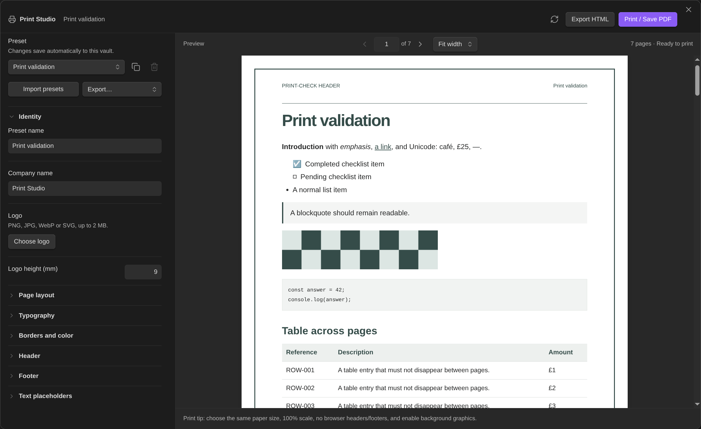

# Print Studio for Obsidian

Turn Markdown notes into branded, paginated documents with logos, headers, footers, page borders, and reusable presets. Preview your pages, print or save a PDF, or export self-contained HTML.

**Desktop Obsidian 1.13.0+ · Free · MIT licensed**



## Install

In Obsidian, open **Settings → Community plugins → Browse**, search for **Print Studio**, then select **Install** and **Enable**. Community plugins require Restricted mode to be off. Updates are available from the same settings page.

For manual installation, download `main.js`, `manifest.json`, and `styles.css` from [GitHub Releases](https://github.com/5krus/obsidian-print-studio/releases/latest) into `<your-vault>/.obsidian/plugins/print-studio/`, reload Obsidian, and enable the plugin. When updating manually, keep your existing `data.json`.

## Use

Open a note and run **Print Studio: Preview & print current note**, click the printer ribbon icon, or right-click a note and choose **Open in Print Studio**.

- **Design:** choose A4 or Letter, portrait or landscape, margins, typography, colors, borders, and a logo. Optionally use a larger, separate first-page letterhead.
- **Presets:** changes save automatically in your vault. Duplicate, import, or export presets—including logos—and undo/redo up to 20 changes per session.
- **Preview:** navigate by page and zoom from 50–200% or fit to width. Layout changes retain your page and zoom. Layout warnings link to possible clipping or oversized table rows.
- **Refresh note:** pick up changes to the note, properties, or attachments. Layout edits otherwise reuse the rendered content.

Use **Insert placeholder…** in any header/footer field for company, note title, date, vault, page numbers, or text/number/boolean note properties. For example:

```text
Prepared for {{meta:client}}
{{page}} / {{pages}}
```

Enable **Page break before headings** to start each subsequent top-level heading on a new page. For a manual break, put `<!-- pagebreak -->` on its own line outside a code fence. Frontmatter is omitted from the printed body.

## Print and export

Choose **Print / Save PDF** once the preview is ready. In the print dialog, match the preview’s paper size and orientation, use **100% scale** and **no added margins**, disable browser headers/footers, and enable background graphics.

**Export HTML** downloads the finished pages with embedded styles and images, without JavaScript. Open it in a desktop Chromium-based browser to print if the system dialog is unavailable in Obsidian. Preview zoom does not affect output size.

## Compatibility and privacy

Standard Markdown and vault image attachments are supported. Remote, missing, or oversized attachments (over 10 MB) become labeled placeholders. Embedded notes/PDFs, dynamic plugin blocks, and complex MathJax/Mermaid content may not render faithfully. Check the preview; long rows or header/footer text may need simpler formatting or larger margins.

Print Studio reads the current note and resolves referenced images through targeted vault lookups. It does not enumerate the vault. Presets and logos live in the plugin’s `data.json`, which may be synchronized by your vault setup. Outside-vault access is limited to logo/preset files you select and exports you save.

No accounts, payments, telemetry, or cloud services are required. Print Studio makes no network requests of its own. Obsidian or enabled Markdown plugins may load remote resources during initial note rendering; the isolated print preview blocks network access.

Physical printing and Windows/macOS print dialogs remain unverified. See the [validation report](docs/VALIDATION.md) for version-specific test coverage.

## Development

Requires Node.js 22+ and npm.

```sh
npm ci
npm run check     # lint, unit tests, and build
npm run package   # local installable folder and ZIP
```

`npm run test:browser` runs the browser/PDF suite and requires Chromium and Poppler. CI runs validation and packaging; the separate release workflow builds attested installer assets. See the [release and provenance guide](docs/COMMUNITY_SUBMISSION.md).

## Support and license

Report bugs or request features in [GitHub Issues](https://github.com/5krus/obsidian-print-studio/issues). Include your Obsidian version, operating system, and a minimal example with sensitive information removed.

[MIT license](LICENSE) · [Third-party licenses and attribution](THIRD_PARTY_NOTICES.md)
