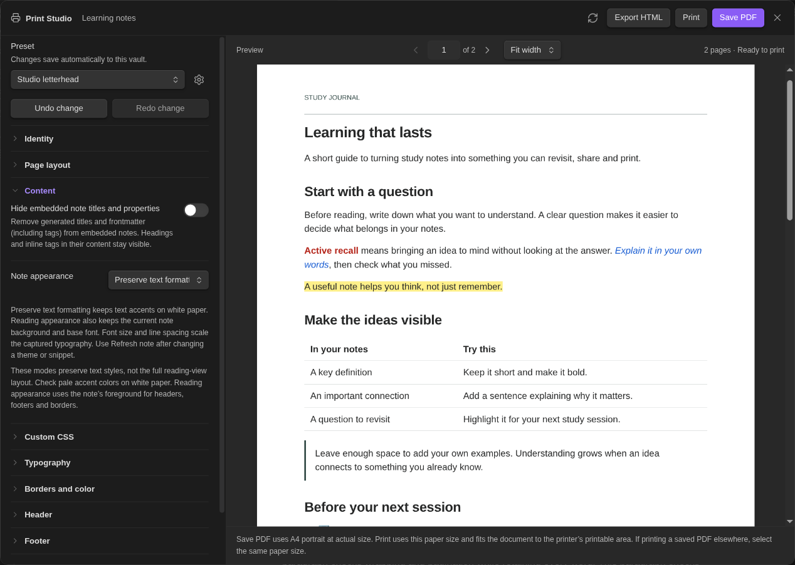
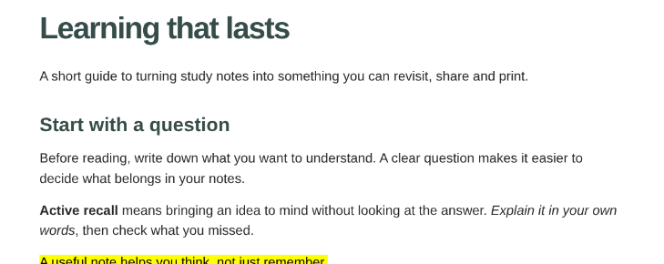
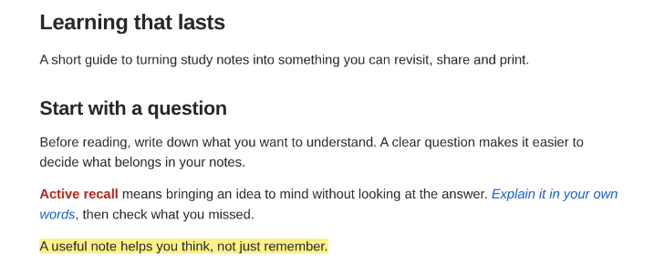

# Keep your note’s colours and highlights

[← Print Studio](../README.md) · [Layout and printing guide](GUIDE.md)

Open **Content → Note appearance** and choose how your note should look on paper.



| Appearance | What it keeps |
| --- | --- |
| **Studio styles** | Print Studio’s preset-driven look. This is the default. |
| **Preserve text formatting** | Supported colours, highlights, relative text sizes, bold, italics and other text accents, on white paper. |
| **Reading appearance (experimental)** | The text styling plus the note’s base font, foreground and background. Print Studio still controls the page layout. |

Supported styling can come from CSS snippets, inline formatting and plugins such as Fast Text Color. Note `cssclasses` and per-note Fast Text Color themes are supported.

### The same note, two appearances

**Studio styles**



**Preserve text formatting**



Appearance choices save with the preset. **Font size** and **Line spacing** scale the captured typography. After changing a theme or snippet, click **Refresh note**.

## Add a little print-specific CSS

Open **Custom CSS**, enter rules in **Print CSS**, and turn on **Enable custom CSS**. For example:

```css
strong { color: #b42318; }
em { color: #175cd3; }
mark { background-color: #fef08a; color: #262727; }
```

These rules apply after the selected appearance and save with the preset. Your source note is unchanged. Turn the switch off to stop applying the rules without deleting them.

CSS affects the note body, including its headings; it does not change page headers, footers or the Print Studio interface. Use `.ps-content` to target the whole note body:

```css
.ps-content { font-family: Georgia, serif; }
p { margin-bottom: 1em; }
```

Text, spacing and border properties are supported. Use literal colours and installed fonts. Page rules, `@media`, `@import`, CSS variables, resource URLs, positioning, display and generated content are unsupported. `!important` is ignored; selector specificity and rule order decide which styles win.

If a rule is unsupported, an inline message explains the problem. Correct it, disable custom CSS or use **Undo change** to resume exporting.

## What to check in the preview

- **Contrast:** pale colours may be hard to read on white paper. Dark backgrounds retain your chosen text colours too.
- **Fonts:** fonts available only through a theme’s web stylesheet are not embedded; use an installed font for consistent results.
- **Layout:** reading appearance preserves supported text styling, not every theme layout or interactive plugin widget.

Snippets that use CSS variables can still work through **Preserve text formatting**, because Print Studio captures their resolved values. Snippets that depend on a particular workspace layout may differ. Use **Refresh note** if a plugin’s styling has not appeared yet.
