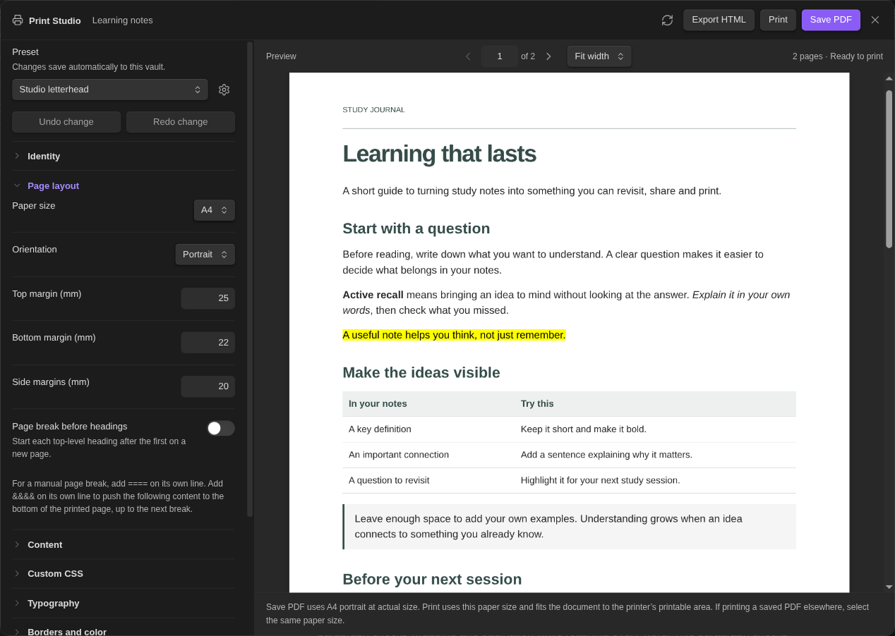
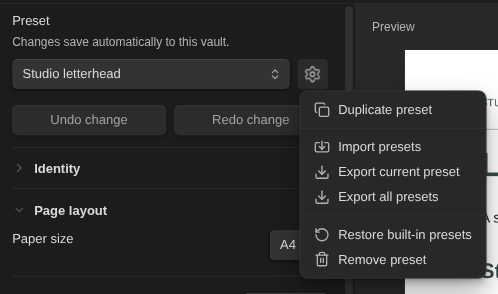

# Make your first document

[← Print Studio](../README.md) · [Colours and custom CSS](FORMATTING.md)

Install and enable **Print Studio** from Obsidian’s **Settings → Community plugins → Browse**. Open a note, then click the printer ribbon icon or run **Print Studio: Preview & print current note** from the command palette.



## Choose a layout

Start with **Studio letterhead**, **Editorial** or **Essential**. Open the sections on the left to adjust your document:

| Section | Use it for |
| --- | --- |
| **Identity** | Preset name, company name and logo. |
| **Page layout** | Paper size, orientation, margins and heading breaks. |
| **Content** | Note appearance and embedded-note titles/properties. |
| **Typography** | Font, size and line spacing. |
| **Borders and color** | Page border and document colour. |
| **Header / Footer** | Text at the top and bottom of each page. |
| **First page** | A separate first-page letterhead. |

The preview updates as you edit. Use its page controls and zoom to inspect the result. Changes save automatically; **Undo change** and **Redo change** work while this window stays open.

## Keep a layout for next time

Open the **gear beside the preset selector**. Choose **Duplicate preset**, then rename the copy under **Identity**.



**Export current preset** or **Export all presets** saves a backup, including logos and custom CSS. **Import presets** adds copies, so you can move layouts between vaults.

**Restore built-in presets** resets the three originals, even if you renamed them, and brings back deleted originals. Your custom and imported presets stay intact. Duplicate a customised original before restoring if you want to keep it. You can undo restoration while Print Studio stays open.

## Add page numbers and note details

In a header or footer field, use **Insert placeholder…**. For example:

```text
{{title}}
{{page}} / {{pages}}
Prepared for {{meta:client}}
```

The last example uses the note’s `client` property. Company, date and vault name are also available. Each field has an **Uppercase** switch if you want capitalised output.

## Control page breaks

Enable **Page layout → Page break before headings** to start each top-level heading after the first on a new page.

For a manual break, put `====` on its own line with blank lines around it:

```markdown
End of the first section.

====

# Next section
```

To place a cover title near the bottom of its page:

```markdown
&&&&

# My report

Subtitle or author

====

# First section
```

These markers do not print. In the note editor, they stay hidden until you move the cursor to their line. Existing `<!-- pagebreak -->` markers also work.

## Print and export

Wait for **Ready to print**, then choose **Save PDF**, **Print** or **Export HTML**.

On mobile and Apple Vision Pro, **Open PDF** replaces **Print**. **Save PDF** saves in the vault's **Print Studio Exports** folder; **Open PDF** also opens the saved file. Print Studio closes to reveal the PDF; use the file menu to share it or print from an app that supports printing. Existing exports are kept, with numbered filenames for later copies. HTML and preset backups save into the same folder.

Mobile PDFs contain high-resolution page images rather than selectable text. Some complex CSS may render differently, so inspect the saved PDF before sharing. Use desktop export when you need selectable text. Your presets and logos work on both platforms.

- **Save PDF** uses the selected paper size and orientation. Preview zoom has no effect on the saved page size.
- **Print** opens printer selection. On Linux, select the printer and copies inside Obsidian; a configured CUPS printer is required. On Windows and macOS, use the system print dialog.
- **Export HTML** creates a self-contained document. Open it in a desktop Chromium-based browser to view or print it.

If printing a saved PDF from another app, choose the matching A4/Letter paper and **Fit to printable area**. That app’s print settings can override the PDF’s preferences.

## When something looks different

| What you see | Try this |
| --- | --- |
| An old version of the note or its colours | Click **Refresh note**. |
| An unwanted title or properties above an embedded note | Enable **Content → Hide embedded note titles and properties**. |
| Clipped header or footer | Follow the preview warning; shorten the text or increase the top/bottom margin. |
| Missing images | Use vault attachments. Remote, missing or oversized images (over 10 MB) become placeholders. |
| A complex embed or plugin block looks different | Check a simpler example; not all dynamic layouts are supported. |

Physical printer output and Windows/macOS print dialogs have not been verified. See the [validation report](VALIDATION.md) for coverage.

Still stuck? [Report a problem](https://github.com/5krus/obsidian-print-studio/issues) with your Obsidian version, operating system and a small example without private information.
