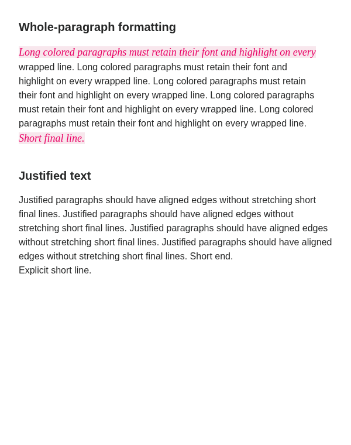
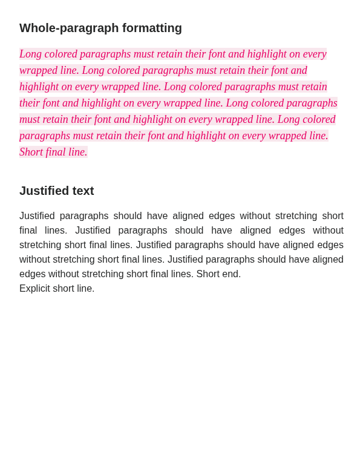

# Print Studio validation

## 0.4.2 whole-paragraph formatting and justification (#1)

- Reproduced the lost middle-line font/color with nested inline spans. The original snapshot code also discarded justification when converting soft wraps to explicit breaks.
- Snapshots now retain inline formatting ancestors. Justified lines preserve soft-wrap spacing, including page continuations, while explicit breaks and paragraph endings retain natural spacing. First-line indentation and print margins remain covered.
- Lint, all **59 unit tests**, TypeScript/build, **four bundled PDF/desktop-boundary tests**, and packaging pass. The **42 browser/PDF tests** include glyph-position comparisons, long colored/highlighted paragraphs in both appearance modes, blank lines, page splits, zoomed export, independent HTML output, and PDF text/page-count checks.
- **12 native PDFs** pass in Linux ARM64 Obsidian 1.13.7 with Fast Text Color 1.1.12, using a separate synthetic vault. Light/dark text and reading modes, classic appearance, and custom CSS were checked through Save PDF and captured Linux Print. All text markers survive, preview text stays within the margins, and matching output paths have identical extracted text. Native PDFs were also inspected visually.
- Physical printer submission and Windows/macOS native dialogs were not tested. The reporter’s exact CSS/note was unavailable; the synthetic reproduction matches the visible formatting loss and exercises the actual Fast Text Color plugin.

The screenshots below show the same synthetic content through the 0.4.1 snapshot function and the corrected function. They are browser captures, not personal notes.

| Before | After |
| --- | --- |
|  |  |

## 0.4.1 review compliance with unchanged output

- All **59 unit tests**, TypeScript/build, packaging, and **four additional PDF/desktop-boundary tests bundled with the production PDF-Lib source build** pass. The latter run automatically in `npm run check`.
- Strict ESLint with `--no-inline-config` and both reported rules set to errors reports **zero style or DOM-helper findings**. The previous file exemptions are removed. The built `main.js` contains none of `__awaiter`, `__generator` or `__spreadArray`.
- All **37 browser/PDF tests** pass. Studio, text-preservation and reading-appearance reference PDFs have identical extracted text and byte-identical first-page PNGs to the saved 0.4.0 outputs. Custom CSS, exported HTML, preset controls, page furniture, page boundaries and embedded media remain covered.
- **12 native formatting PDFs** pass in Obsidian 1.13.7 with Fast Text Color 1.1.12, across light/dark appearances and custom CSS, through Save PDF and captured Linux Print. All 12 have identical extracted text to 0.4.0. All six first-page native PNGs are byte-identical after fixing the lab's preset, header and footer inputs. The validator now starts from Essential and explicit text slots so prior lab edits and dates cannot alter the comparison.
- **16 native baseline PDFs** pass across A4/Letter, portrait/landscape and regular/first-page letterheads, with page dimensions, counts and all content markers retained.
- Temporary-file permissions and directory cleanup, rejected printer/copy inputs, cancellation without overwriting an existing PDF, and blocked print-window navigation are checked. The isolated iframe still receives no Obsidian globals or parent DOM access.

Early browser attempts stalled under local memory pressure; the completed run passed after memory was freed. Physical printing was replaced by file capture, and the personal vault was not modified. Windows/macOS dialogs and physical printers remain manual checks. The public community score requires the directory's own scan; filesystem/process capability disclosures may remain.

For a hands-on check after updating, open a representative study note, compare the three **Note appearance** modes, enable your custom CSS, then save a PDF and export HTML. Inspect highlights, page boundaries and the final paragraph in both files. Existing presets should keep their settings. More detailed steps are in [development and testing](DEVELOPMENT.md#check-the-formatting-output).

## 0.4.0 note appearance, custom CSS and preset management

Usage, limitations and hands-on checks are in [the formatting guide](FORMATTING.md).

- Lint, TypeScript/build, packaging, and all **59 unit tests** pass. Coverage includes legacy preset imports, appearance/CSS persistence, reset identities and capacity, preservation allowlists, malformed CSS, frontmatter preparation, and export payload escaping.
- The complete **37-test browser/PDF suite** passes on the release source. This includes preserved text and reading appearance, custom CSS, inheritance and specificity, safe HTML serialization, preset management and keyboard behavior, plus the existing embedded-figure, page-break, cover, image-conversion, and eight paper/orientation/letterhead regressions.
- The actual Obsidian preset menu was visually checked and exercised for keyboard navigation, Escape/outside dismissal, focus return, duplicate/undo, and cancellation of remove/restore dialogs. The close button was checked at 1200px and 600px viewport widths: it aligns with the header within one CSS pixel, and click-to-close works. The hidden native title no longer leaves a scrolling offset above the studio header.
- **12 native formatting PDFs** passed in Obsidian **1.13.7** with the actual **Fast Text Color 1.1.12** plugin: Studio/text/reading/custom appearances in light mode, plus text/reading appearances in dark mode, each through Save PDF and the Linux Print adapter. All 24 row markers, special formatting markers, and the final marker survive exactly once; page counts and A4 dimensions match. Source frontmatter stays out of the printed body. Save PDF and Print produce identical extracted text.
- **16 baseline native PDFs** also passed across A4/Letter, portrait/landscape, and regular/first-page letterheads. Every page size and count matches its browser reference, and all 65 table rows, 12 paragraphs, and final marker remain present.
- Actual generated PDFs were rasterized with Poppler and visually reviewed for white-paper formatting, dark reading appearance, and custom CSS. Browser assertions check resolved colors, backgrounds, weight, size, font inheritance, embedded text styles, and script-free independent HTML output.
- Native testing exposed and fixed a per-note Fast Text Color theme mismatch: frontmatter now reaches Obsidian's postprocessors before its generated display is removed. Browser testing exposed and fixed a missing content-root reference in Paged.js that prevented scoped styles from applying consistently.
- Restoring defaults supports Cancel/Escape, persistent replacement/recreation of originals, preservation of custom presets, and undo/redo. The 0.4.0 local-install ZIP passes its archive integrity check. A generated empty test vault was also smoke-tested.
- Test outputs are kept in `test-results/`, `test-results-formatting-final/`, and `test-results-native-formatting/`; they contain synthetic content. The separate `print-studio-lab` vault includes sample notes, a snippet, the actual formatting plugin, and three sample presets. The working vault was not modified.

Some early browser attempts timed out under memory pressure while Obsidian and Chromium were running together. Passing verification runs used them separately. Physical printer submission was replaced by file capture; no physical pages were printed. Windows/macOS dialogs, arbitrary third-party layouts, externally supplied fonts, and full theme fidelity remain manual/compatibility checks. Reading appearance is explicitly experimental.

## 0.3.13 consistent preview and output text

- Lint, 53 unit tests, TypeScript/build, packaging, and all 28 browser/PDF tests passed.
- Completed pages retain measured text line breaks before pagination-only CSS columns are disabled. This prevents a new print window's font rounding from wrapping the final lines into hidden columns. Inline markup and selectable text are retained.
- A synthetic regression demonstrates the original off-page tail when text metrics change in a fresh window, then verifies the final amount and all paragraph text survive the fixed PDF. Coverage includes explicit/blank lines, styled text, subscript/superscript, Unicode, long links, nested lists, tables, and media.
- All 16 native outputs (Save PDF and Linux Print across eight paper/orientation/letterhead snapshots) passed in Obsidian's Electron engine. Page dimensions, counts, table rows, paragraphs, and end markers were checked without physical printer submission.
- Reproduced the reported paragraph loss through both native output paths. With the fix, the live preview's amount remains on its original line in both outputs. A final private-document capture retained all source text in the PDF body, accounting for generated list numbers and table-cell extraction order; Save PDF and Linux Print produced identical extracted text. Private content is excluded from tests and release assets.
- Physical printing and Windows/macOS native dialogs remain manual checks.

## 0.3.12 embedded figure pagination

- Lint, 53 unit tests, TypeScript/build, packaging, and all 26 browser/PDF tests passed.
- A synthetic native embed with tables, a large square figure, a caption, and trailing text reproduces the missing figure in A4 portrait before the fix. After the fix, all content and the original-resolution image survive preview and PDF export across A4/Letter and portrait/landscape.
- Nested preview display containers are unwrapped after metadata filtering; the outer embed and all body content remain. Unit coverage checks nested embeds and both metadata visibility settings.
- Verified the reported document in a running Obsidian instance using the production markup fix in a temporary preview. Pagination changed from four incomplete pages to five complete pages; both images and every source text character survived after whitespace and pagination-hyphen normalization. Private notes and images are not included in tests or release assets.
- Physical printing remains a manual check; the printer and PDF output adapters are unchanged.

## 0.3.11 printer media and image compatibility

- Lint, 52 unit tests, TypeScript/build, and all 22 browser/PDF tests passed.
- New regressions verify explicit CUPS A4/Letter and orientation options, printer discovery, copy-count validation, temporary-file cleanup on success/failure, PDF page dimensions and viewer preferences, and preservation of image bytes and transparency masks.
- A browser-generated transparent diagram is processed by the production PDF adapter, converted with Ghostscript, and rendered with Poppler. Red/blue diagram areas and selectable text survive. Ghostscript is now required in CI and release validation.
- All 16 outputs (Save PDF and Linux Print across eight paper/orientation/letterhead snapshots) passed in the real Obsidian Electron engine. Page counts, all page dimensions, 65 table rows, 12 paragraphs, and end markers were verified; physical submission is substituted with a file capture.
- The fix also preserved both images in the locally reported PDF through the same Ghostscript conversion that previously removed them. That private document is not included in tests or release assets.
- The printer/copies dialog was also exercised inside Obsidian: system printer discovery, A4 summary, and cancellation passed without submitting a physical job.
- Windows/macOS physical print dialogs and physical printing of this release remain manual checks.

## 0.3.9 paper size and direct PDF saving

- Replaced iframe `window.print()` with separate **Save PDF** and **Print** actions. The desktop adapter receives a frozen, script-free copy of the paginated preview and its selected preset.
- PDF generation explicitly selects paper size, orientation, CSS page size, scale 1, background graphics, no browser headers/footers, and zero additional margins. Physical printing passes the equivalent settings to Electron with `silent: false`.
- Lint, 46 unit tests, TypeScript/build, and all 21 browser/PDF tests pass. Output regressions cover unsolicited, duplicate and stale frame messages, busy buttons, failure recovery, save cancellation, print cancellation, and hidden-window cleanup.
- The browser matrix now exercises the actual Save PDF and Print message paths at 150% preview zoom, verifies every PDF page’s dimensions, and compares all extracted text with the HTML export.
- Native verification on Linux, Obsidian 1.13.7 / Electron 43.3.0, runs the production desktop PDF adapter against all eight A4/Letter × portrait/landscape × normal/first-page-letterhead snapshots. All page dimensions and counts match, and all 65 table rows, 12 paragraphs, and end marker survive. Only the filename dialog is substituted with a test output path; BrowserWindow and printToPDF are real.
- Reproduce with `npm run test:browser` followed by `node scripts/validate-native.mjs` while Obsidian is running with its CLI enabled. Generated PDFs stay in `test-results/`.
- No physical print job was submitted. Printer-driver overrides and Windows/macOS dialogs remain unverified.

## 0.3.7 embedded-note metadata

- Lint, 42 unit tests, TypeScript/build, and 21 browser/PDF tests cover the release.
- A new browser test verifies that hiding generated embed titles and frontmatter reclaims vertical space, preserves body headings/inline tags/code and nested embeds, saves the option, supports undo/redo, and carries through to exported HTML and PDF.
- Unit checks cover scoped removal, preservation of note-body wrappers that carry Obsidian's `mod-frontmatter` class, unchanged media captions, frame payloads, and compatibility with older preset backups.
- The filter was checked inside native Obsidian on a detached copy of a live embedded note. Three generated title/frontmatter elements were removed; body content and the live original DOM were unchanged.
- The initial local browser run had two timeouts during preview/UI operations; the affected tests were rerun separately. Release CI must pass the complete suite before publication.
- This native check validates the metadata filter, not the full system print dialog. Physical printing and Windows/macOS print dialogs remain unverified.

## 0.3.6 uppercase fields

- Lint, all 39 unit tests, TypeScript/build, and all 20 Chromium browser/PDF tests pass.
- The uppercase test exercises all nine header, footer, and first-page field switches; resolved titles, dates, vault/company names, properties, page totals, and accented text; saved settings; independent toggling; and undo.
- Exported HTML and PDF retain uppercase header/footer text while the document body and source templates retain their original casing.
- Unit checks cover defaults for older settings and backups, malformed uppercase flags, preset round-trips, independent copies, and undo/redo snapshots.
- Physical printing and Windows/macOS print dialogs remain unverified. Native Obsidian validation below applies to 0.2.0.

## 0.3.3 repository cleanup

- The plugin build and browser test build no longer depend on the standalone demo. Test-only DOM controls and theme styles live under `tests/support`.
- Validation covers lint, 33 unit tests, TypeScript/build, and 14 browser/PDF tests from a checkout without local demo files.
- Production runtime and stylesheet output remain identical to 0.3.2; only release metadata changes in the installer assets.
- The remaining sandbox DOM-helper warning is intentional; see [REVIEW_NOTES.md](REVIEW_NOTES.md).

## 0.3.2 source and CSS review follow-up

- Local lint now covers both plugin and demo source; lint, all 33 unit tests, TypeScript and build pass.
- All 14 browser/PDF tests pass in Chromium, including the existing eight paper/orientation/letterhead export cases and a new removal-dialog test covering Cancel, Escape, initial focus, focus restoration, confirmation and undo.
- The panel and sanitizer use the host's element factory: native Obsidian helpers in the plugin and standard DOM in the standalone demo. The print iframe remains sandboxed without parent DOM access.
- A release-workflow failure exposed a timing-sensitive page-input issue. A deterministic unit regression reproduces a queued viewport report overwriting a typed page number; the input now retains uncommitted edits.
- Browser-only lint exceptions and why they are necessary are recorded in [REVIEW_NOTES.md](REVIEW_NOTES.md).
- Native Obsidian testing of 0.3.x, physical printing and Windows/macOS print dialogs remain unverified.

## 0.3.1 review follow-up

- Local lint, all 32 unit tests, TypeScript, and build pass.
- Five attachment-resolution tests cover precise resource paths, encoded names, Windows-style resource URI fixtures, relative Markdown images, unsaved wiki embeds, missing files, unsupported types, and rejection of external/out-of-vault paths. These are fixture tests, not a native Windows validation claim.
- Source no longer calls vault-wide file enumeration APIs. Images use targeted file or link lookups against the rendered note's references.
- The manual release workflow requires all 13 browser/PDF tests to pass before it attests the three installer assets and creates the draft. The workflow run records the tested source commit and provenance; published files should be verified with `gh attestation verify` as described in the README.
- Native testing of the new attachment resolver remains a manual check. The native validation below applies to 0.2.0.

## 0.3.0 submission candidate

Validated on 13 September 2026:

- Full lint, 27 unit tests, TypeScript/build, and local ZIP packaging pass.
- All 13 browser tests pass using installed Chromium, including eight PDF cases covering A4/Letter, portrait/landscape, and regular/separate first-page letterheads.
- PDF checks verify page dimensions and counts, all content markers, headers and footers, page totals, decoded images, and first-page-only branding.
- New checks exercise cached source reads, concurrent refreshes and failure recovery, retained/clamped page navigation, bounded undo/redo, placeholder selection replacement, legacy preset imports, clipped header/footer warnings, and split table row warnings.
- Standard PDF fixtures produce no layout warnings. Oversized-row and clipped-furniture fixtures produce actionable page links.
- The final submission-candidate run passes all 13 browser tests, including keyboard focus after toggling the first-page header and undo/redo interactions. The earlier browser setup timeout was resolved by rerunning after machine load returned to normal.

This build has not yet been smoke-tested in native Obsidian or on physical paper. The native validation below applies to 0.2.0. Windows/macOS print dialogs remain unverified.

## 0.2.0 validation

Validation performed on 13 September 2026.

## Automated checks

- Obsidian’s recommended ESLint rules: no errors or warnings.
- Unit tests: templates, settings recovery, duplicate IDs, sanitization, checklist states, removal of code-block controls, stale preview protection, theme synchronization, safe frame messages, preset import/export, format/size limits, and atomic imports.
- Browser/PDF suite: A4 portrait, A4 landscape, Letter portrait, Letter landscape, preset/navigation/theme interactions, and pagination with animation frames suspended.
- Each PDF fixture includes 65 uniquely identified table rows, 12 uniquely identified paragraphs, an image, repeated logos, code, a blockquote, Unicode text, checklists, and a manual page break.
- Checks compare preview and PDF page counts and paper dimensions; require all content markers exactly once; verify every page’s header/footer and page number; and ensure exported HTML has no scripts and no preview zoom.
- Runtime dependency audit: no reported vulnerabilities at validation time.

Run `npm run check` and `npm run test:browser`. The latter requires Chromium and Poppler. Generated PDFs are kept in `test-results/` and are not committed.

## Native Obsidian

Tested on Obsidian **1.13.7**, Linux, using its documented CLI:

- Reloaded the plugin and rendered a dedicated validation note with Obsidian’s Markdown renderer.
- Confirmed native buttons, dropdowns, toggles, page navigation, and preview readiness.
- Exported the actual native-rendered document and verified its seven-page PDF, all 65 rows, all 12 paragraphs, images, and every header/footer.
- Captured the release screenshot from the live plugin modal, using synthetic test content and presets. Light/dark theme synchronization is also covered by the browser suite.
- Confirmed no Obsidian runtime errors and preserved the original preset data.

The minimum supported version is 1.13.0, based on the native APIs used and checked by Obsidian’s API compatibility lint rule. Versions 1.13.0–1.13.6 have not been tested individually.

## Manual checks remaining

There is no configured printer on this machine, so no physical print job was submitted. Before a public launch:

- Print the validation note on A4 and Letter paper where available.
- Select the same paper size and orientation, 100% scale, no added margins or browser headers/footers, and background graphics enabled.
- Check borders, logos, first/last lines on each page, and page totals on paper.
- Exercise the system print dialog on Windows and macOS before claiming those environments as tested.

Long unbreakable rows and complex plugin-rendered content remain subject to the rendering limitations in the README.

## 0.3.8 embedded-note serialization

Lint, unit tests, TypeScript/build, and all 21 browser/PDF tests passed. Regression tests construct native-style span embeds through DOM operations and verify that serialization preserves metadata scope, nested content, surrounding text and formatting, image embeds, and the original DOM. Browser tests use the same native-style fixture to verify the metadata toggle through pagination and export.
