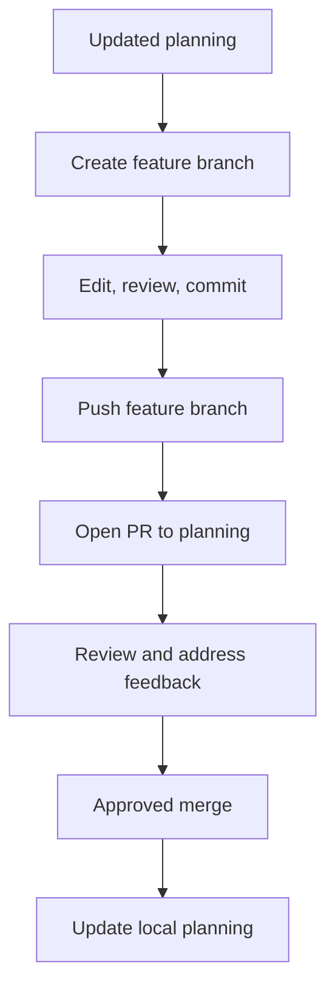
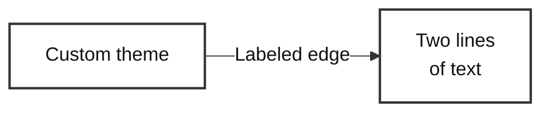

# Planning flow

```mermaid
flowchart TD
A["Updated planning"] --> B["Create feature branch"]
B --> C["Edit, review, commit"]
C --> D["Push feature branch"]
D --> E["Open PR to planning"]
E --> F["Review and address feedback"]
F --> G["Approved merge"]
G --> H["Update local planning"]
```

END-OF-DIAGRAM

====

# Custom Mermaid styling

```mermaid
%%{init: {'theme': 'base', 'themeVariables': {'primaryColor': '#ffffff', 'primaryTextColor': '#111111', 'primaryBorderColor': '#333333', 'lineColor': '#333333'}}}%%
flowchart LR
A["Custom theme"] -->|Labeled edge| B["Two lines<br/>of text"]
classDef custom fill:#ffffff,color:#111111,stroke:#333333,stroke-width:2px
class A,B custom
```
